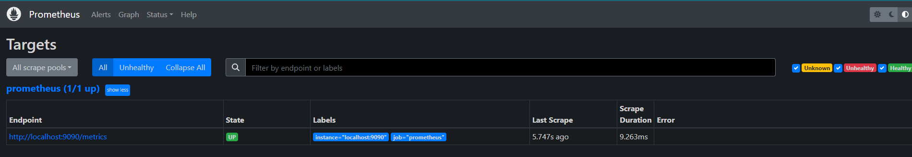
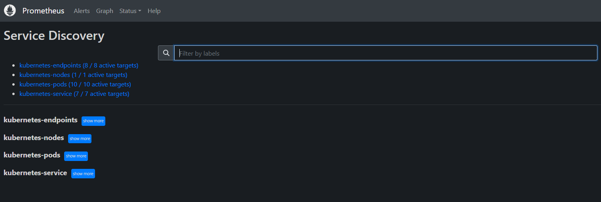
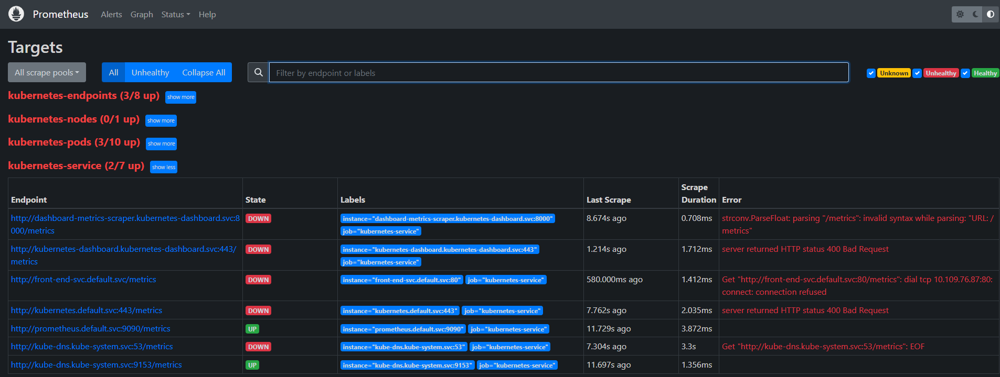

# prometheus监控kubernetes

## 部署Prometheus  

### 在Kubernetes下部署Prometheus  

### 使用ConfigMaps管理应用配置  

当使用Deployment管理和部署应用程序时，用户可以方便了对应用进行扩容或者缩容，从而产生多个Pod实例。为了能够统一管理这些Pod的配置信息，在Kubernetes中可以使用ConfigMaps资源定义和管理这些配置，并且通过环境变量或者文件系统挂载的方式让容器使用这些配置。

这里将使用ConfigMaps管理Prometheus的配置文件，创建prometheus-config.yml文件，并写入以下内容：  

```yaml
apiVersion: v1
kind: ConfigMap
metadata:
  name: prometheus-config
data:
  prometheus.yml: |
    global:
      scrape_interval:     15s 
      evaluation_interval: 15s
    scrape_configs:
      - job_name: 'prometheus'
        static_configs:
        - targets: ['localhost:9090']
```  

使用kubectl命令行工具，在命名空间default创建ConfigMap资源：  

```shell
kubectl create -f prometheus-config.yml
configmap "prometheus-config" created
```  

### 使用Deployment部署Prometheus  

当ConfigMap资源创建成功后，我们就可以通过Volume挂载的方式，将Prometheus的配置文件挂载到容器中。 这里我们通过Deployment部署Prometheus Server实例，创建prometheus-deployment.yml文件，并写入以下内容:  

```yaml
apiVersion: v1
kind: Service
metadata:
  name: prometheus
  labels:
    app: prometheus
spec:
  ports:
  - name: prometheus
    protocol: TCP
    port: 9090
    targetPort: 9090
    nodePort: 30090
  selector:
    app: prometheus
  type: NodePort
---
apiVersion: apps/v1
kind: Deployment
metadata:
  name: prometheus
  labels:
    app: prometheus
spec:
  replicas: 1
  selector:
    matchLabels:
      app: prometheus
  template:
    metadata:
      labels:
        app: prometheus
    spec:
      containers:
      - name: prometheus
        image: prom/prometheus:v2.45.1
        command:
        - "/bin/prometheus"
        args:
        - "--config.file=/etc/prometheus/prometheus.yml"
        ports:
        - containerPort: 9090
          protocol: TCP
        volumeMounts:
        - mountPath: "/etc/prometheus"
          name: prometheus-config
      volumes:
      - name: prometheus-config
        configMap:
          name: prometheus-config
```  

该文件中分别定义了Service和Deployment，Service类型为NodePort，这样我们可以通过虚拟机IP和端口访问到Prometheus实例。为了能够让Prometheus实例使用ConfigMap中管理的配置文件，这里通过volumes声明了一个磁盘卷。并且通过volumeMounts将该磁盘卷挂载到了Prometheus实例的/etc/prometheus目录下。
使用以下命令创建资源，并查看资源的创建情况：  

```shell
$ kubectl apply -f prometheus-deployment.yml
service/prometheus created
deployment.apps/prometheus created

lulin@guokang-yuankun MINGW64 ~/Desktop/prometheus
$ kubectl get pod
NAME                          READY   STATUS    RESTARTS   AGE
prometheus-5b6d6cff89-44bff   1/1     Running   0          12s

lulin@guokang-yuankun MINGW64 ~/Desktop/prometheus
$ kubectl get svc
NAME            TYPE        CLUSTER-IP       EXTERNAL-IP   PORT(S)          AGE
prometheus      NodePort    10.108.250.141   <none>        9090:30090/TCP   15s
```  

至此，我们可以通过IP地址和端口30090访问到Prometheus的服务。

  

## Kubernetes下的服务发现  

目前为止，我们已经能够在Kubernetes下部署一个简单的Prometheus实例，不过当前来说它并不能发挥其监控系统的作用，除了Prometheus，暂时没有任何的监控采集目标。在第7章中，我们介绍了Prometheus的服务发现能力，它能够与通过与“中间代理人“的交互，从而动态的获取需要监控的目标实例。而在Kubernetes下Prometheus就是需要与Kubernetes的API进行交互，从而能够动态的发现Kubernetes中部署的所有可监控的目标资源。

### Kubernetes的访问授权  

为了能够让Prometheus能够访问收到认证保护的Kubernetes API，我们首先需要做的是，对Prometheus进行访问授权。在Kubernetes中主要使用基于角色的访问控制模型(Role-Based Access Control)，用于管理Kubernetes下资源访问权限。首先我们需要在Kubernetes下定义角色（ClusterRole），并且为该角色赋予相应的访问权限。同时创建Prometheus所使用的账号（ServiceAccount），最后则是将该账号与角色进行绑定（ClusterRoleBinding）。这些所有的操作在Kubernetes同样被视为是一系列的资源，可以通过YAML文件进行描述并创建，这里创建prometheus-rbac-setup.yml文件，并写入以下内容：  

```yaml
apiVersion: rbac.authorization.k8s.io/v1
kind: ClusterRole
metadata:
  name: prometheus
rules:
- apiGroups: [""]
  resources:
  - nodes
  - nodes/proxy
  - services
  - endpoints
  - pods
  verbs: ["get", "list", "watch"]
- apiGroups:
  - extensions
  resources:
  - ingresses
  verbs: ["get", "list", "watch"]
- nonResourceURLs: ["/metrics"]
  verbs: ["get"]
---
apiVersion: v1
kind: ServiceAccount
metadata:
  name: prometheus
  namespace: default
---
apiVersion: rbac.authorization.k8s.io/v1
kind: ClusterRoleBinding
metadata:
  name: prometheus
roleRef:
  apiGroup: rbac.authorization.k8s.io
  kind: ClusterRole
  name: prometheus
subjects:
- kind: ServiceAccount
  name: prometheus
  namespace: default
```  

其中需要注意的是ClusterRole是全局的，不需要指定命名空间。而ServiceAccount是属于特定命名空间的资源。通过kubectl命令创建RBAC对应的各个资源：  

```shell
kubectl apply -f prometheus-rbac-setup.yml 
clusterrole.rbac.authorization.k8s.io/prometheus created
serviceaccount/prometheus unchanged
clusterrolebinding.rbac.authorization.k8s.io/prometheus created
```  

在完成角色权限以及用户的绑定之后，就可以指定Prometheus使用特定的ServiceAccount创建Pod实例。修改prometheus-deployment.yml文件，并添加serviceAccountName和serviceAccount定义：  

```yaml
spec:
  replicas: 1
  template:
    metadata:
      labels:
        app: prometheus
    spec:
      serviceAccountName: prometheus
      serviceAccount: prometheus
```  

通过kubectl apply对Deployment进行变更升级：

```shell
$ kubectl apply -f prometheus-deployment.yml 
service/prometheus unchanged
deployment.apps/prometheus configured
```  

指定ServiceAccount创建的Pod实例中，会自动将用于访问Kubernetes API的CA证书以及当前账户对应的访问令牌文件挂载到Pod实例的/var/run/secrets/kubernetes.io/serviceaccount/目录下，可以通过以下命令进行查看：  

```shell
$ kubectl exec -it prometheus-595b89ddfc-8hv26 -- sh
/prometheus $
/prometheus $ ls /var/run/secrets/kubernetes.io/serviceaccount/
ca.crt     namespace  token
/prometheus $
```  

### 服务发现  

在Kubernetes下，Promethues通过与Kubernetes API集成目前主要支持5种服务发现模式，分别是：Node、Service、Pod、Endpoints、Ingress。

通过kubectl命令行，可以方便的获取到当前集群中的所有节点信息：  

```shell
kubectl get nodes -o wide
```

为了能够让Prometheus能够获取到当前集群中所有节点的信息，在Promtheus的配置文件中，我们添加如下Job配置：  

```yaml
- job_name: 'kubernetes-nodes'
  tls_config:
    ca_file: /var/run/secrets/kubernetes.io/serviceaccount/ca.crt
  bearer_token_file: /var/run/secrets/kubernetes.io/serviceaccount/token
  kubernetes_sd_configs:
  - role: node
```  

通过指定kubernetes_sd_config的模式为node，Prometheus会自动从Kubernetes中发现到所有的node节点并作为当前Job监控的Target实例。如下所示，这里需要指定用于访问Kubernetes API的ca以及token文件路径。

对于Ingress，Service，Endpoints, Pod的使用方式也是类似的，下面给出了一个完整Prometheus配置的示例：  

```yaml
apiVersion: v1
data:
  prometheus.yml: |-
    global:
      scrape_interval:     15s 
      evaluation_interval: 15s
    scrape_configs:
    - job_name: 'kubernetes-nodes'
      tls_config:
        ca_file: /var/run/secrets/kubernetes.io/serviceaccount/ca.crt
      bearer_token_file: /var/run/secrets/kubernetes.io/serviceaccount/token
      kubernetes_sd_configs:
      - role: node
    - job_name: 'kubernetes-service'
      tls_config:
        ca_file: /var/run/secrets/kubernetes.io/serviceaccount/ca.crt
      bearer_token_file: /var/run/secrets/kubernetes.io/serviceaccount/token
      kubernetes_sd_configs:
      - role: service
    - job_name: 'kubernetes-endpoints'
      tls_config:
        ca_file: /var/run/secrets/kubernetes.io/serviceaccount/ca.crt
      bearer_token_file: /var/run/secrets/kubernetes.io/serviceaccount/token
      kubernetes_sd_configs:
      - role: endpoints
    - job_name: 'kubernetes-ingress'
      tls_config:
        ca_file: /var/run/secrets/kubernetes.io/serviceaccount/ca.crt
      bearer_token_file: /var/run/secrets/kubernetes.io/serviceaccount/token
      kubernetes_sd_configs:
      - role: ingress
    - job_name: 'kubernetes-pods'
      tls_config:
        ca_file: /var/run/secrets/kubernetes.io/serviceaccount/ca.crt
      bearer_token_file: /var/run/secrets/kubernetes.io/serviceaccount/token
      kubernetes_sd_configs:
      - role: pod
kind: ConfigMap
metadata:
  name: prometheus-config  
```  

更新Prometheus配置文件，并重建Prometheus实例：

```shell
$ kubectl apply -f prometheus-config.yml
configmap/prometheus-config configured  

$ kubectl delete -f prometheus-deployment.yml 
service "prometheus" deleted
deployment.apps "prometheus" deleted

$ kubectl apply -f prometheus-deployment.yml
service/prometheus created
deployment.apps/prometheus created
```  

Prometheus使用新的配置文件重建之后，打开Prometheus UI，通过Service Discovery页面可以查看到当前Prometheus通过Kubernetes发现的所有资源对象了：  

  
目前为止，我们已经能够通过Prometheus自动发现Kubernetes集群中的各类资源以及其基本信息。不过，如果现在查看Promtheus的Target状态页面，结果可能会让人不太满意：

  
  
虽然Prometheus能够自动发现所有的资源对象，并且将其作为Target对象进行数据采集。 但并不是所有的资源对象都是支持Promethues的，并且不同类型资源对象的采集方式可能是不同的。因此，在实际的操作中，我们需要有明确的监控目标，并且针对不同类型的监控目标设置不同的数据采集方式。

接下来，我们将利用Promtheus的服务发现能力，实现对Kubernetes集群的全面监控。  

## 监控Kubernetes集群  

### 使用Prometheus监控Kubernetes集群  

Promtheus在Kubernetes下的服务发现能力，并且通过kubernetes_sd_config实现了对Kubernetes下各类资源的自动发现。利用Promethues提供的服务发现能力，实现对Kubernetes集群以及其中部署的各类资源的自动化监控。  

下表中，梳理了监控Kubernetes集群监控的各个维度以及策略：  

|目标 | 服务发现模式 | 监控方法 | 数据源|  
|---|---|---|---|  
| 从集群各节点kubelet组件中获取节点kubelet的基本运行状态的监控指标 | node | 白盒监控 | kubelet |  
| 从集群各节点kubelet内置的cAdvisor中获取，节点中运行的容器的监控指标 | node | 白盒监控| kubelet |  
| 从部署到各个节点的Node Exporter中采集主机资源相关的运行资源 | node | 白盒监控 | node exporter |  
| 对于内置了Promthues支持的应用，需要从Pod实例中采集其自定义监控指标 | pod | 白盒监控 | custom pod |  
| 获取API Server组件的访问地址，并从中获取Kubernetes集群相关的运行监控指标 |endpoints| 白盒监控 |api server |  
| 获取集群中Service的访问地址，并通过Blackbox Exporter获取网络探测指标 |service| 黑盒监控| blackbox exporter |
| 获取集群中Ingress的访问信息，并通过Blackbox Exporter获取网络探测指标 |ingress| 黑盒监控| blackbox exporter |  

### 从Kubelet获取节点运行状态  

Kubelet组件运行在Kubernetes集群的各个节点中，其负责维护和管理节点上Pod的运行状态。kubelet组件的正常运行直接关系到该节点是否能够正常的被Kubernetes集群正常使用。

基于Node模式，Prometheus会自动发现Kubernetes中所有Node节点的信息并作为监控的目标Target。 而这些Target的访问地址实际上就是Kubelet的访问地址，并且Kubelet实际上直接内置了对Promtheus的支持。

修改prometheus.yml配置文件，并添加以下采集任务配置：

```yaml
  - job_name: 'kubernetes-kubelet'
    scheme: https
    tls_config:
      ca_file: /var/run/secrets/kubernetes.io/serviceaccount/ca.crt
    bearer_token_file: /var/run/secrets/kubernetes.io/serviceaccount/token
    kubernetes_sd_configs:
    - role: node
    relabel_configs:
    - action: labelmap
      regex: __meta_kubernetes_node_label_(.+)
```

这里使用Node模式自动发现集群中所有Kubelet作为监控的数据采集目标，同时通过labelmap步骤，将Node节点上的标签，作为样本的标签保存到时间序列当中。

重新加载promethues配置文件，并重建Promthues的Pod实例后，查看kubernetes-kubelet任务采集状态:  

```error
Get "https://192.168.65.3:10250/metrics": tls: failed to verify certificate: x509: cannot validate certificate for 192.168.65.3 because it doesn't contain any IP SANs
```

这是由于当前使用的ca证书中，并不包含192.168.65.3的地址信息。为了解决该问题，第一种方法是直接跳过ca证书校验过程，通过在tls_config中设置 insecure_skip_verify为true即可。 这样Promthues在采集样本数据时，将会自动跳过ca证书的校验过程，从而从kubelet采集到监控数据：  

```yaml
  - job_name: 'kubernetes-kubelet'
      scheme: https
      tls_config:
        ca_file: /var/run/secrets/kubernetes.io/serviceaccount/ca.crt
        insecure_skip_verify: true
      bearer_token_file: /var/run/secrets/kubernetes.io/serviceaccount/token
      kubernetes_sd_configs:
      - role: node
      relabel_configs:
      - action: labelmap
        regex: __meta_kubernetes_node_label_(.+)
```

第二种方式，不直接通过kubelet的metrics服务采集监控数据，而通过Kubernetes的api-server提供的代理API访问各个节点中kubelet的metrics服务，如下所示：  

```yaml
  - job_name: 'kubernetes-kubelet'
      scheme: https
      tls_config:
        ca_file: /var/run/secrets/kubernetes.io/serviceaccount/ca.crt
      bearer_token_file: /var/run/secrets/kubernetes.io/serviceaccount/token
      kubernetes_sd_configs:
      - role: node
      relabel_configs:
      - action: labelmap
        regex: __meta_kubernetes_node_label_(.+)
      - target_label: __address__
        replacement: kubernetes.default.svc:443
      - source_labels: [__meta_kubernetes_node_name]
        regex: (.+)
        target_label: __metrics_path__
        replacement: /api/v1/nodes/${1}/proxy/metrics
```

通过relabeling，将从Kubernetes获取到的默认地址__address__替换为kubernetes.default.svc:443。同时将__metrics_path__替换为api-server的代理地址/api/v1/nodes/${1}/proxy/metrics。  

### 从Kubelet获取节点容器资源使用情况　　

各节点的kubelet组件中除了包含自身的监控指标信息以外，kubelet组件还内置了对cAdvisor的支持。cAdvisor能够获取当前节点上运行的所有容器的资源使用情况，通过访问kubelet的/metrics/cadvisor地址可以获取到cadvisor的监控指标，因此和获取kubelet监控指标类似，这里同样通过node模式自动发现所有的kubelet信息，并通过适当的relabel过程，修改监控采集任务的配置。 与采集kubelet自身监控指标相似，这里也有两种方式采集cadvisor中的监控指标：

方式一：直接访问kubelet的/metrics/cadvisor地址，需要跳过ca证书认证：

```yaml
    - job_name: 'kubernetes-cadvisor'
      scheme: https
      tls_config:
        ca_file: /var/run/secrets/kubernetes.io/serviceaccount/ca.crt
        insecure_skip_verify: true
      bearer_token_file: /var/run/secrets/kubernetes.io/serviceaccount/token
      kubernetes_sd_configs:
      - role: node
      relabel_configs:
      - source_labels: [__meta_kubernetes_node_name]
        regex: (.+)
        target_label: __metrics_path__
        replacement: metrics/cadvisor
      - action: labelmap
        regex: __meta_kubernetes_node_label_(.+)
```  

方式二：通过api-server提供的代理地址访问kubelet的/metrics/cadvisor地址：

```yaml
    - job_name: 'kubernetes-cadvisor'
      scheme: https
      tls_config:
        ca_file: /var/run/secrets/kubernetes.io/serviceaccount/ca.crt
      bearer_token_file: /var/run/secrets/kubernetes.io/serviceaccount/token
      kubernetes_sd_configs:
      - role: node
      relabel_configs:
      - target_label: __address__
        replacement: kubernetes.default.svc:443
      - source_labels: [__meta_kubernetes_node_name]
        regex: (.+)
        target_label: __metrics_path__
        replacement: /api/v1/nodes/${1}/proxy/metrics/cadvisor
      - action: labelmap
        regex: __meta_kubernetes_node_label_(.+)
```  

### 使用NodeExporter监控集群资源使用情况  

为了能够采集集群中各个节点的资源使用情况，我们需要在各节点中部署一个Node Exporter实例。在本章的“部署Prometheus”小节，我们使用了Kubernetes内置的控制器之一Deployment。Deployment能够确保Prometheus的Pod能够按照预期的状态在集群中运行，而Pod实例可能随机运行在任意节点上。而与Prometheus的部署不同的是，对于Node Exporter而言每个节点只需要运行一个唯一的实例，此时，就需要使用Kubernetes的另外一种控制器Daemonset。顾名思义，Daemonset的管理方式类似于操作系统中的守护进程。Daemonset会确保在集群中所有（也可以指定）节点上运行一个唯一的Pod实例。

创建node-exporter-daemonset.yml文件，并写入以下内容：  

```yaml
apiVersion: apps/v1
kind: DaemonSet
metadata:
  name: node-exporter
spec:
  selector:
    matchLabels:
      app: node-exporter
  template:
    metadata:
      annotations:
        prometheus.io/scrape: 'true'
        prometheus.io/port: '9100'
        prometheus.io/path: '/metrics'
      labels:
        app: node-exporter
    spec:
      containers:
      - image: prom/node-exporter
        imagePullPolicy: IfNotPresent
        name: node-exporter
        ports:
        - containerPort: 9100
          hostPort: 9100
          name: scrape
      hostNetwork: true
      hostPID: true
```

由于Node Exporter需要能够访问宿主机，因此这里指定了hostNetwork和hostPID，让Pod实例能够以主机网络以及系统进程的形式运行。同时YAML文件中也创建了NodeExporter相应的Service。这样通过Service就可以访问到对应的NodeExporter实例。  

```shell
kubectl apply -f node-exporter-daemonset.yml 
daemonset.apps/node-exporter created
```  

查看Daemonset以及Pod的运行状态

```shell
kubectl get daemonsets
NAME            DESIRED   CURRENT   READY   UP-TO-DATE   AVAILABLE   NODE SELECTOR   AGE
node-exporter   1         1         1       1            1           <none>          93s
```

由于Node Exporter是以主机网络的形式运行，因此直接访问主机IP加上Pod的端口即可访问当前节点上运行的Node Exporter实例:

```shell
curl ip:9100/metrics
```

目前为止，通过Daemonset的形式将Node Exporter部署到了集群中的各个节点中。接下来，我们只需要通过Prometheus的pod服务发现模式，找到当前集群中部署的Node Exporter实例即可。 需要注意的是，由于Kubernetes中并非所有的Pod都提供了对Prometheus的支持，有些可能只是一些简单的用户应用，为了区分哪些Pod实例是可以供Prometheus进行采集的，这里我们为Node Exporter添加了注解：

```yaml
prometheus.io/scrape: 'true'
```

由于Kubernetes中Pod可能会包含多个容器，还需要用户通过注解指定用户提供监控指标的采集端口：

```yaml
prometheus.io/port: '9100'
```

而有些情况下，Pod中的容器可能并没有使用默认的/metrics作为监控采集路径，因此还需要支持用户指定采集路径：

```yaml
prometheus.io/path: 'metrics'
```

为Prometheus创建监控采集任务kubernetes-pods，如下所示：  

```yaml
  - job_name: 'kubernetes-pods'
    kubernetes_sd_configs:
    - role: pod
    relabel_configs:
    - source_labels: [__meta_kubernetes_pod_annotation_prometheus_io_scrape]
      action: keep
      regex: true
    - source_labels: [__meta_kubernetes_pod_annotation_prometheus_io_path]
      action: replace
      target_label: __metrics_path__
      regex: (.+)
    - source_labels: [__address__, __meta_kubernetes_pod_annotation_prometheus_io_port]
      action: replace
      regex: ([^:]+)(?::\d+)?;(\d+)
      replacement: $1:$2
      target_label: __address__
    - action: labelmap
      regex: __meta_kubernetes_pod_label_(.+)
    - source_labels: [__meta_kubernetes_namespace]
      action: replace
      target_label: kubernetes_namespace
    - source_labels: [__meta_kubernetes_pod_name]
      action: replace
      target_label: kubernetes_pod_name
```  

通过以上relabel过程实现对Pod实例的过滤，以及采集任务地址替换，从而实现对特定Pod实例监控指标的采集。需要说明的是kubernetes-pods并不是只针对Node Exporter而言，对于用户任意部署的Pod实例，只要其提供了对Prometheus的支持，用户都可以通过为Pod添加注解的形式为其添加监控指标采集的支持。

### 从kube-apiserver获取集群运行监控指标  

创建监控任务kubernetes-apiservers，这里指定了服务发现模式为endpoints。Promtheus会查找当前集群中所有的endpoints配置，并通过relabel进行判断是否为apiserver对应的访问地址：  

```yaml
    - job_name: 'kubernetes-apiservers'
      kubernetes_sd_configs:
      - role: endpoints
      scheme: https
      tls_config:
        ca_file: /var/run/secrets/kubernetes.io/serviceaccount/ca.crt
      bearer_token_file: /var/run/secrets/kubernetes.io/serviceaccount/token
      relabel_configs:
      - source_labels: [__meta_kubernetes_namespace, __meta_kubernetes_service_name, __meta_kubernetes_endpoint_port_name]
        action: keep
        regex: default;kubernetes;https
      - target_label: __address__
        replacement: kubernetes.default.svc:443
```  

在relabel_configs配置中第一步用于判断当前endpoints是否为kube-apiserver对用的地址。第二步，替换监控采集地址到kubernetes.default.svc:443即可。重新加载配置文件，重建Promthues实例  

对Ingress和Service进行网络探测  

为了能够对Ingress和Service进行探测，我们需要在集群部署Blackbox Exporter实例。 如下所示，创建blackbox-exporter.yaml用于描述部署相关的内容:  

```yaml
apiVersion: v1
kind: Service
metadata:
  labels:
    app: blackbox-exporter
  name: blackbox-exporter
spec:
  ports:
  - name: blackbox
    port: 9115
    protocol: TCP
  selector:
    app: blackbox-exporter
  type: ClusterIP
---
apiVersion: apps/v1
kind: Deployment
metadata:
  labels:
    app: blackbox-exporter
  name: blackbox-exporter
spec:
  replicas: 1
  selector:
    matchLabels:
      app: blackbox-exporter
  template:
    metadata:
      labels:
        app: blackbox-exporter
    spec:
      containers:
      - image: prom/blackbox-exporter
        imagePullPolicy: IfNotPresent
        name: blackbox-exporter
```  

通过kubectl命令部署Blackbox Exporter实例，这里将部署一个Blackbox Exporter的Pod实例，同时通过服务blackbox-exporter在集群内暴露访问地址blackbox-exporter.default.svc.cluster.local，对于集群内的任意服务都可以通过该内部DNS域名访问Blackbox Exporter实例

为了能够让Prometheus能够自动的对Service进行探测，我们需要通过服务发现自动找到所有的Service信息。 如下所示，在Prometheus的配置文件中添加名为kubernetes-services的监控采集任务：  

```yaml
    - job_name: 'kubernetes-services'
      metrics_path: /probe
      params:
        module: [http_2xx]
      kubernetes_sd_configs:
      - role: service
      relabel_configs:
      - source_labels: [__meta_kubernetes_service_annotation_prometheus_io_probe]
        action: keep
        regex: true
      - source_labels: [__address__]
        target_label: __param_target
      - target_label: __address__
        replacement: blackbox-exporter.default.svc.cluster.local:9115
      - source_labels: [__param_target]
        target_label: instance
      - action: labelmap
        regex: __meta_kubernetes_service_label_(.+)
      - source_labels: [__meta_kubernetes_namespace]
        target_label: kubernetes_namespace
      - source_labels: [__meta_kubernetes_service_name]
        target_label: kubernetes_name
```  

对于Ingress而言，也是一个相对类似的过程，这里给出对Ingress探测的Promthues任务配置作为参考：

```yaml
    - job_name: 'kubernetes-ingresses'
      metrics_path: /probe
      params:
        module: [http_2xx]
      kubernetes_sd_configs:
      - role: ingress
      relabel_configs:
      - source_labels: [__meta_kubernetes_ingress_annotation_prometheus_io_probe]
        action: keep
        regex: true
      - source_labels: [__meta_kubernetes_ingress_scheme,__address__,__meta_kubernetes_ingress_path]
        regex: (.+);(.+);(.+)
        replacement: ${1}://${2}${3}
        target_label: __param_target
      - target_label: __address__
        replacement: blackbox-exporter.default.svc.cluster.local:9115
      - source_labels: [__param_target]
        target_label: instance
      - action: labelmap
        regex: __meta_kubernetes_ingress_label_(.+)
      - source_labels: [__meta_kubernetes_namespace]
        target_label: kubernetes_namespace
      - source_labels: [__meta_kubernetes_ingress_name]
        target_label: kubernetes_name
```
